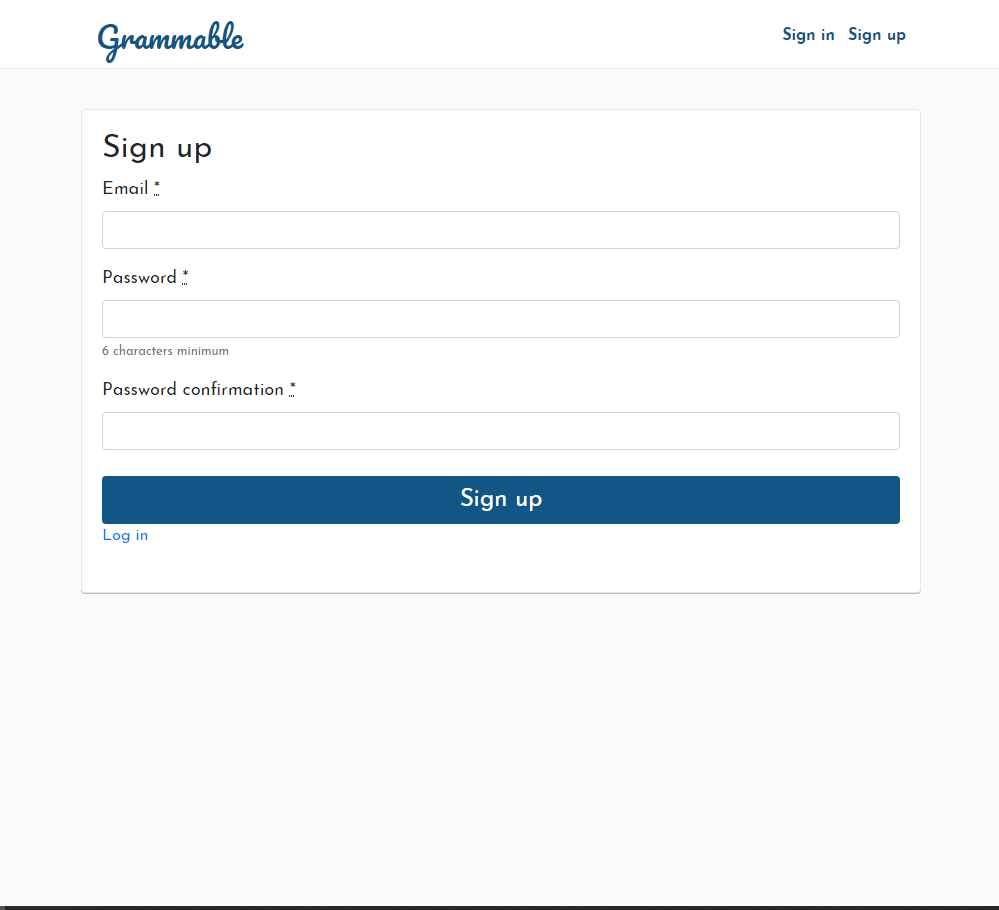
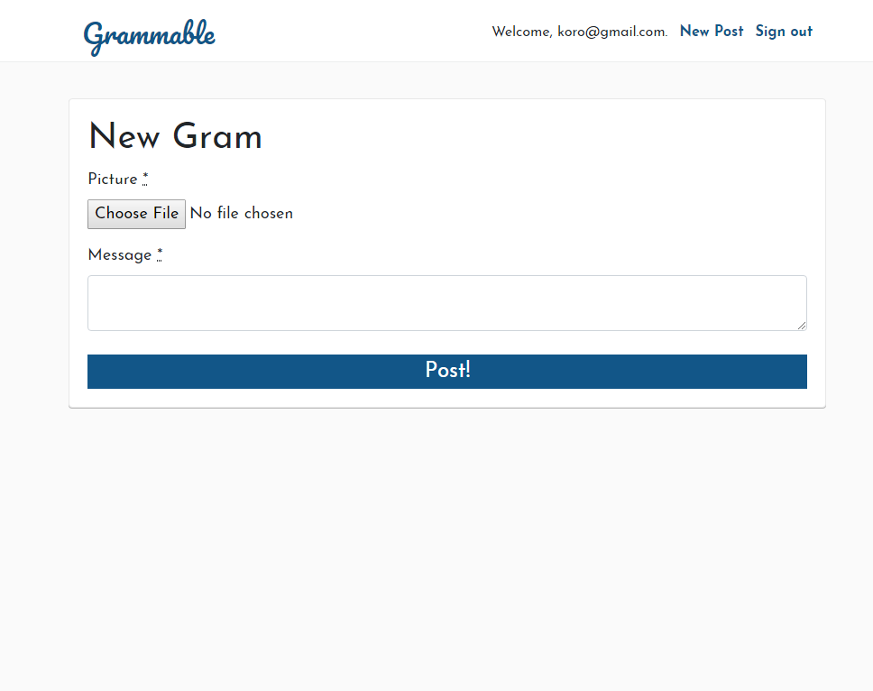
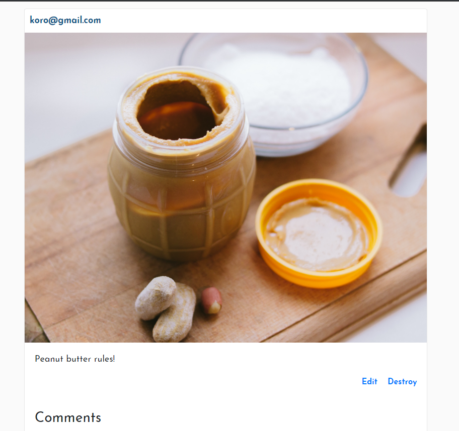
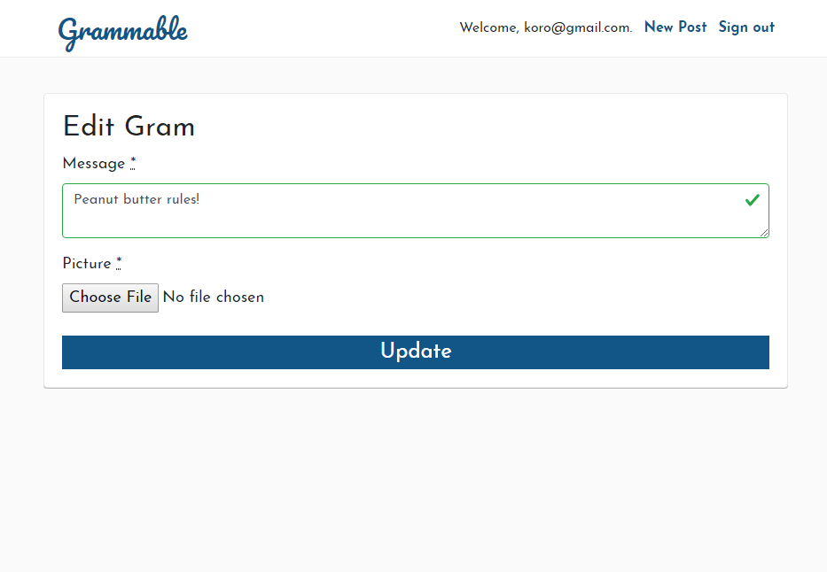
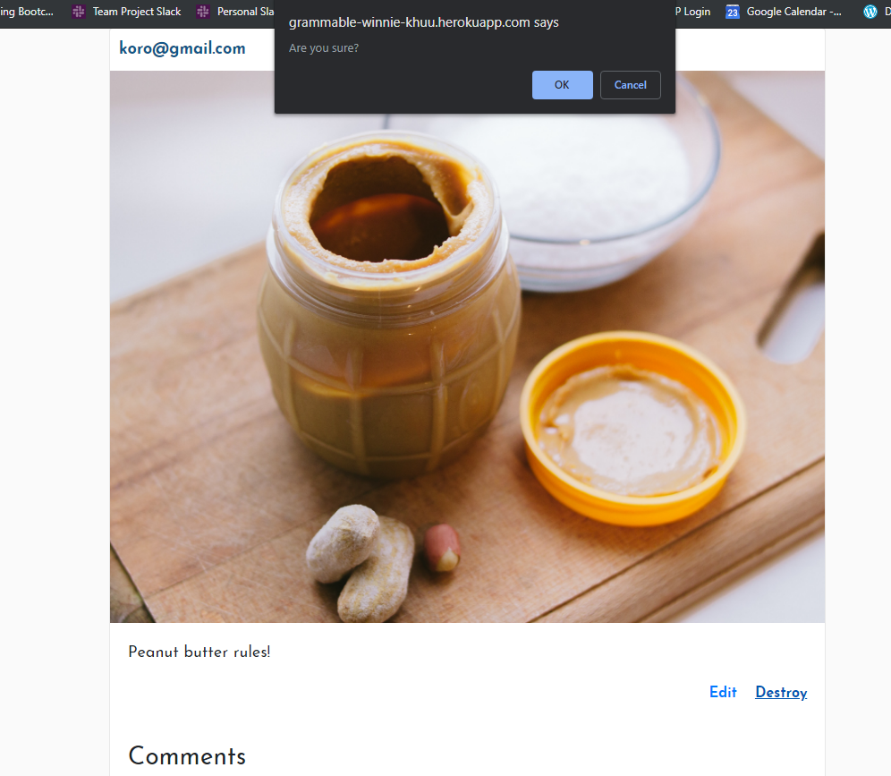

# README

Grammable is written in Ruby on Rails framework.
Grammable is an Instagram app clone that allows users to share and comment on photos. 

See it in action <a href="https://grammable-winnie-khuu.herokuapp.com">here</a>.

## TECHNOLOGIES USED
* HTML
* CSS
* Ruby
* Rails
* Algorithms
* Vagrant
* PuTTY
* RubyMine

## SEE IT LOCALLY

1. Download the repository and unzip the files.
2. In your preferred coding environment, navigate to the folder `cd XXXXX/grammable-master`
3. Run `bundle install` to install the required Ruby gems.
3. Run `rake db:create db: migrate` to set up the database.
4. Visit your localhost link (i.e. localhost:3030 or localhost:3000)

## SCREENSHOTS

Index page with all photos by all users

Sign up page

Upload a new gram

New gram uploaded

Edit gram capability

Destroy gram capability
